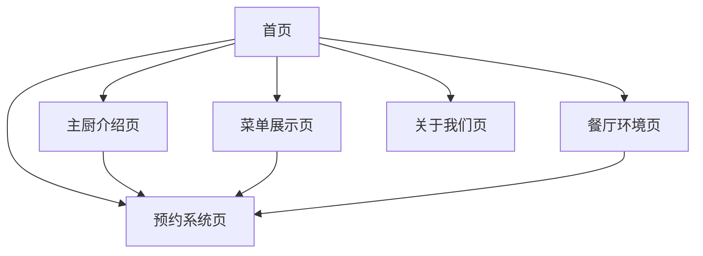

# 星曜餐厅网站产品需求文档

## 1. 产品概述

星曜是一家米其林三星法式私厨餐厅的官方网站，旨在展现顶级法式料理的精致艺术和餐厅的奢华品质。
网站将为高端客户提供沉浸式的品牌体验，通过精美的视觉设计和流畅的用户体验，传达米其林三星的卓越声誉和法式料理的艺术魅力。
目标是打造一个能够吸引高端客户并促进预约转化的顶级餐厅展示平台。

## 2. 核心功能

### 2.1 用户角色

| 角色 | 访问方式 | 核心权限 |
|------|----------|----------|
| 访客用户 | 直接访问网站 | 浏览餐厅信息、查看菜单、提交预约申请 |
| 默认用户 | 无需注册登录 | 完整访问所有展示功能和预约系统 |

### 2.2 功能模块

我们的星曜餐厅网站包含以下主要页面：
1. **首页**：品牌展示区、导航菜单、餐厅亮点展示、米其林认证展示
2. **主厨介绍页**：主厨个人简介、职业经历、料理理念、获奖荣誉
3. **菜单展示页**：季节性菜单、招牌菜品、酒水搭配、价格信息
4. **预约系统页**：在线预约表单、时间选择、人数确认、特殊需求备注
5. **餐厅环境页**：用餐环境展示、包间介绍、氛围营造
6. **关于我们页**：餐厅历史、品牌故事、米其林认证、联系方式

### 2.3 页面详情

| 页面名称 | 模块名称 | 功能描述 |
|----------|----------|----------|
| 首页 | 品牌展示区 | 展示餐厅logo、slogan和核心价值主张，营造奢华第一印象 |
| 首页 | 导航菜单 | 提供清晰的页面导航，包含所有主要功能入口 |
| 首页 | 餐厅亮点 | 突出展示米其林三星认证、特色菜品预览、用餐环境 |
| 首页 | 米其林认证展示 | 显著展示米其林三星标识和相关荣誉证书 |
| 主厨介绍页 | 主厨简介 | 详细介绍主厨背景、教育经历、职业成就 |
| 主厨介绍页 | 料理理念 | 阐述主厨的烹饪哲学和对法式料理的独特见解 |
| 主厨介绍页 | 获奖荣誉 | 展示主厨获得的各项专业认证和奖项 |
| 菜单展示页 | 季节性菜单 | 展示当季特色菜品，包含精美图片和详细描述 |
| 菜单展示页 | 招牌菜品 | 重点推荐餐厅经典菜品和主厨特色创作 |
| 菜单展示页 | 酒水搭配 | 提供专业的葡萄酒搭配建议和精选酒单 |
| 预约系统页 | 预约表单 | 收集客户姓名、联系方式、用餐日期时间等信息 |
| 预约系统页 | 时间选择 | 提供可预约的时间段选择，实时显示可用性 |
| 预约系统页 | 特殊需求 | 允许客户备注饮食偏好、过敏信息、庆祝场合等 |
| 餐厅环境页 | 用餐环境展示 | 通过高质量图片展示餐厅内部装潢和氛围 |
| 餐厅环境页 | 包间介绍 | 详细介绍不同包间的特色和适用场合 |
| 关于我们页 | 餐厅历史 | 讲述餐厅创立故事和发展历程 |
| 关于我们页 | 品牌故事 | 传达餐厅的品牌价值观和文化内涵 |
| 关于我们页 | 联系方式 | 提供详细的地址、电话、营业时间等信息 |

## 3. 核心流程

**主要用户操作流程：**
用户首先访问首页了解餐厅品牌和米其林认证，然后可以浏览主厨介绍了解专业背景，查看菜单页面选择心仪菜品，最后通过预约系统提交用餐申请。用户也可以查看餐厅环境页面了解用餐氛围，或访问关于我们页面深入了解品牌故事。

## 4. 用户界面设计

### 4.1 设计风格

- **主色调**：深金色(#B8860B)和象牙白(#FFFFF0)，体现奢华与优雅
- **辅助色**：深蓝色(#1E3A8A)和暖灰色(#6B7280)，增加层次感
- **按钮样式**：圆角矩形按钮，金色渐变效果，悬停时有微妙阴影
- **字体**：标题使用优雅的衬线字体，正文使用清晰的无衬线字体，中文使用思源宋体
- **布局风格**：卡片式布局，顶部导航栏，大量留白营造高端感
- **图标风格**：简约线条图标，金色配色，与整体设计保持一致

### 4.2 页面设计概览

| 页面名称 | 模块名称 | UI元素 |
|----------|----------|--------|
| 首页 | 品牌展示区 | 全屏背景图片，居中logo，优雅字体标题，金色装饰线条 |
| 首页 | 导航菜单 | 顶部固定导航，半透明背景，金色悬停效果 |
| 首页 | 餐厅亮点 | 三栏卡片布局，精美图片，金色边框，阴影效果 |
| 主厨介绍页 | 主厨简介 | 左右分栏布局，左侧主厨照片，右侧文字介绍，优雅排版 |
| 菜单展示页 | 季节性菜单 | 网格布局，高质量菜品图片，悬停放大效果，价格标签 |
| 预约系统页 | 预约表单 | 居中表单设计，圆角输入框，金色提交按钮，表单验证提示 |
| 餐厅环境页 | 用餐环境展示 | 瀑布流图片布局，lightbox弹窗效果，图片说明文字 |
| 关于我们页 | 餐厅历史 | 时间轴设计，图文结合，渐进式展示餐厅发展历程 |

### 4.3 响应式设计

网站采用移动优先的响应式设计策略，确保在桌面端、平板和手机上都能提供优质的浏览体验。针对触屏设备优化交互元素，增大点击区域，简化导航结构，保持视觉效果的一致性。